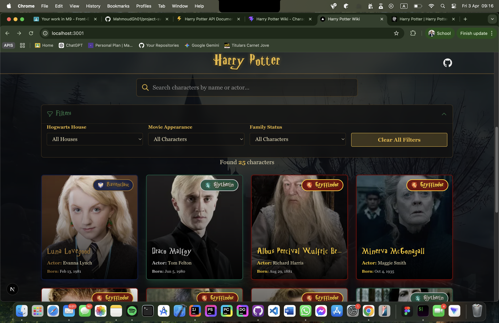

# Harry Potter Wiki

A comprehensive Harry Potter wiki built with Next.js 16, React 19, and TypeScript. Explore the magical world of Harry Potter with detailed information about characters, spells, houses, and more.



## Features

- Modern, responsive design with Tailwind CSS
- Server-side rendering with Next.js App Router
- Type-safe development with TypeScript
- Comprehensive testing with Vitest
- Code quality enforcement with ESLint and Prettier
- Git hooks with Husky for automated quality checks

## Tech Stack

- **Framework:** [Next.js 16.2.0](https://nextjs.org)
- **UI Library:** [React 19.2.4](https://react.dev)
- **Language:** [TypeScript 5](https://www.typescriptlang.org)
- **Styling:** [Tailwind CSS 4](https://tailwindcss.com)
- **Testing:** [Vitest](https://vitest.dev) with React Testing Library
- **Code Quality:** ESLint, Prettier, Husky, lint-staged

## Getting Started

### Prerequisites

- Node.js 20.x or higher
- npm, yarn, pnpm, or bun

### Installation

1. Clone the repository:

```bash
git clone https://github.com/MahmoudGh01/harry-potter-wiki
cd harry-potter-wiki
```

2. Install dependencies:

```bash
npm install
```

3. Run the development server:

```bash
npm run dev
```

4. Open [http://localhost:3000](http://localhost:3000) in your browser to see the application.

## Available Scripts

- `npm run dev` - Start the development server
- `npm run build` - Build the application for production
- `npm run start` - Start the production server
- `npm run lint` - Run ESLint to check for code issues
- `npm run lint:fix` - Automatically fix ESLint issues
- `npm run format` - Format code with Prettier
- `npm run format:check` - Check code formatting without making changes
- `npm run type-check` - Run TypeScript type checking
- `npm test` - Run tests with Vitest

## Project Structure

```
harry-potter-wiki/
├── app/                    # Next.js App Router pages
│   ├── layout.tsx         # Root layout component
│   ├── page.tsx           # Home page
│   └── globals.css        # Global styles
├── components/            # Reusable React components
├── types/                 # TypeScript type definitions
├── public/                # Static assets
├── __tests__/             # Test files
└── .husky/                # Git hooks
```

## Code Quality

This project uses automated code quality tools:

- **ESLint** - Identifies and reports code patterns
- **Prettier** - Enforces consistent code formatting
- **Husky** - Runs pre-commit hooks to ensure code quality
- **lint-staged** - Runs linters on staged files only

Code is automatically linted and formatted before each commit.

## Testing

Run the test suite:

```bash
npm test
```

Tests are written using Vitest and React Testing Library.

## Deployment

### [Live App on Vercel](https://harry-potter-wiki-zeta.vercel.app/)

The easiest way to deploy this application is using the [Vercel Platform](https://vercel.com/new):

1. Push your code to a Git repository (GitHub, GitLab, or Bitbucket)
2. Import your repository to Vercel
3. Vercel will automatically detect Next.js and configure the build settings
4. Deploy!

## API Reference

- [PotterAPI](https://github.com/fedeperin/potterapi) is a Harry Potter API developed with Express.js and available in multiple languages.
  This API stores information and images of books, characters and spells.

- Live Documentation (Swagger UI)
  Explore the API and its endpoints interactively using our [Harry Potter API Documentation](https://vlaurencena.github.io/harry-potter-openapi-swagger-ui/).

### Other Platforms

You can also deploy to other platforms that support Next.js:

```bash
npm run build
npm run start
```

## Contributing

Contributions are welcome! Please follow these steps:

1. Fork the repository
2. Create a feature branch (`git checkout -b feature/amazing-feature`)
3. Commit your changes (`git commit -m 'Add some amazing feature'`)
4. Push to the branch (`git push origin feature/amazing-feature`)
5. Open a Pull Request

Please ensure your code passes all linting and tests before submitting.

## License

This project is an academic example .

## Learn More

- [Next.js Documentation](https://nextjs.org/docs)
- [React Documentation](https://react.dev)
- [TypeScript Documentation](https://www.typescriptlang.org/docs)
- [Tailwind CSS Documentation](https://tailwindcss.com/docs)
